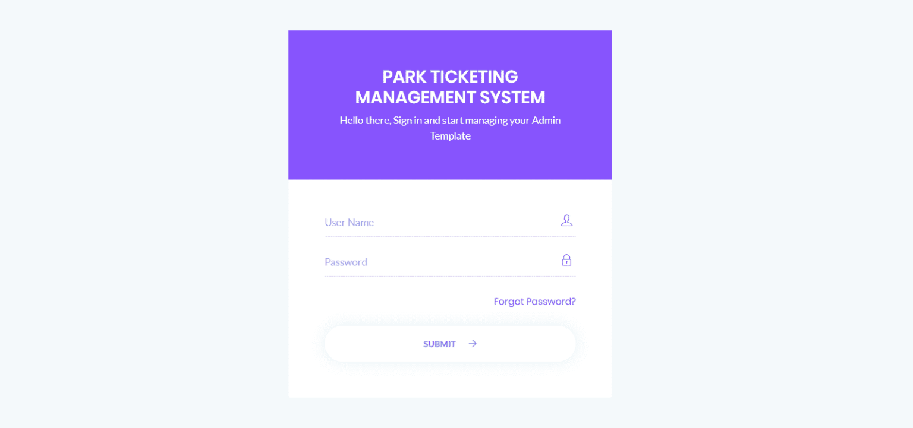

# Park-Ticketing-control-system-in-of-PHP-and-MySQL
This is a park ticket management and control system that allows users to purchase and order tickets online
How to run the Park Ticketing Management System Project (PTMS)
1. Download the zip file

2. Extract the file and copy ptms folder

3.Paste inside root directory(for xampp xampp/htdocs, for wamp wamp/www, for lamp var/www/html)

4. Open PHPMyAdmin (http://localhost/phpmyadmin)

5. Create a database with name ptmsdb

6. Import ptmsdb.sql file(given inside the zip package in SQL file folder)

7.Run the script http://localhost/ptmms

Admin Credential

Email: gordonjohnao@gmail.com at $2 only

<h2>Screenshots</h2>
 </a>